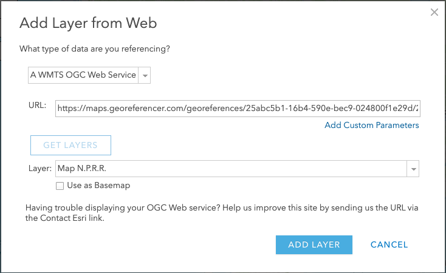

# Map to app 

## Find a map

1. Go to [https://www.davidrumsey.com/](https://www.davidrumsey.com/) and enter "[Northern Pacific Railroad](https://www.davidrumsey.com/luna/servlet/view/search?sort=Pub_List_No_InitialSort%2CPub_Date%2CPub_List_No%2CSeries_No&q=Northern+Pacific+Railroad&search=Go)" as your search term.
2. Find the "[The Yellowstone Park and dining car route to the Pacific Coast](https://www.davidrumsey.com/luna/servlet/detail/RUMSEY~8~1~24214~880043:Map-N-P-R-R-?sort=Pub_List_No_InitialSort%2CPub_Date%2CPub_List_No%2CSeries_No&qvq=q:Northern%20Pacific%20Railroad;sort:Pub_List_No_InitialSort%2CPub_Date%2CPub_List_No%2CSeries_No;lc:RUMSEY~8~1&mi=30&trs=68)" map and click on it's thumbnail to go to it's page.
3. Play around with **Zooming / Full Screen / Etc**...
4. Click on the orange "[View in Georeferencer](https://davidrumsey.georeferencer.com/maps/ff493e4e-68b4-5a78-869a-d47c9649ff60/view)" button, at the top.
5. Zoom in and out, play with the tranparency slider and explore the difference between the new map and the old map. Turn off the old map and zoom in and out. What's different about these two maps? Why?
6. Click on the "This Map" link, at the top of the page.
7. Time permitting, you can create an account with Google Sign in, to see the links for the data service, georeference your own maps and save maps to a 'workspace' for use later. To save time, use the following URL to the **Web Map Tile Service (WMTS)** for the next section...

```
https://maps.georeferencer.com/georeferences/25abc5b1-16b4-590e-bec9-024800f1e29d/2017-02-20T14:25:19.132722Z/wmts?key=mpIMvCWIYHCcIzNaqUSo&SERVICE=WMTS&REQUEST=GetCapabilities
```

## Make a map

1. Go to [This Link](https://www.arcgis.com/sharing/rest/oauth2/signup?client_id=arcgisonline&redirect_uri=http://www.arcgis.com&response_type=token) to create a free [ArcGIS.com](https://www.arcgis.com/index.html#) account, using the Google login button and your Google account credentials, at the bottom of the page. 
2. Click on the "**MAP**" link at the top of the page
3. Click **Add>All Layer from Web** and change the **Drop-down** to "**A WMTS OCG Tile Service**"
4. **Cut & Paste** the WMTS code:
```
https://maps.georeferencer.com/georeferences/25abc5b1-16b4-590e-bec9-024800f1e29d/2017-02-20T14:25:19.132722Z/wmts?key=mpIMvCWIYHCcIzNaqUSo&SERVICE=WMTS&REQUEST=GetCapabilities
```
into the **URL:** textbox
5. Click on the **Get Layers** button, then click on **Add Layer**
6. Wait for the image to load.

7. Zoom and pan around the map
8. Click on the "Find My Location" tool (it's right under the zoom tools), or zoom to the Stanford area. 
9. Click on **Add>Add Map Notes**, then click **Create** with the default settings.
10. Use the **Stickpin** template to create a note where Stanford should be.
11. Fill in the editor as follows:

|                 | **Content**                                                                                                                                                                                     |
|-----------------|-------------------------------------------------------------------------------------------------------------------------------------------------------------------------------------------------|
|          Title: | Leland Stanford Jr. University                                                                                                                                                                  |
|    Description: | The Leland Stanford Junior University was founded in 1885 by California Senator Leland Stanford and his wife, Jane, in memory of their only child, Leland Jr., who died of typhoid fever at 15. |
|      Image URL: | https://www-media.stanford.edu/wp-content/uploads/2017/03/09163847/about-stanford-4-1499x938.jpg                                                                                                |
| Image Link URL: | https://www.stanford.edu/                                                                                                                                                                       |

12 Click close, then click the "**Edit**" button to close the MapNotes panel.   
13. 
 
